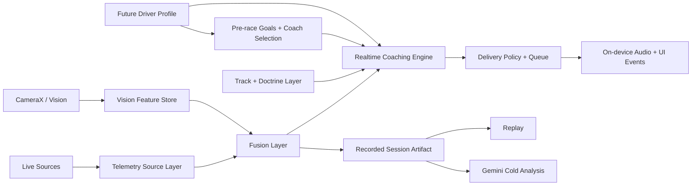

# Consolidation Report

**Branch:** `consolidated`  
**Last updated:** April 28, 2026  
**Purpose:** Document what exists across the three project copies that were evaluated, what has been merged into the consolidated branch, how the overall architecture now fits together, and which stakeholders own each part.

## 1. Repositories Evaluated

### A. Current working repository

**Path:** `/Users/rkaranjai/Documents/trustable-ai-codelab`  
**Git branch at evaluation start:** `rabimba/koru-od`  
**Status:** Most advanced implementation surface

This is the main implementation branch and the basis for consolidation.

### B. Downloaded repository

**Path:** `/Users/rkaranjai/Downloads/trustable-ai-codelab`  
**Git branch:** `edge-telemtry`  
**Status:** Browser-first repo with cross-team planning artifacts

This repo is largely a web/PWA-oriented planning and implementation snapshot. It does not contain the native Android app. Its main unique asset relative to the current repo was `docs/user-stories.md`.

### C. Downloaded snapshot

**Path:** `/Users/rkaranjai/Downloads/trustable-ai-codelab-main`  
**Git status:** not a git repo, plain snapshot  
**Status:** Browser/data-reasoning snapshot with some useful retained assets

This snapshot is much closer to the advanced web/data-reasoning path than the `edge-telemtry` repo. It also does not contain the native Android app. Its unique retained assets relative to the current repo were:

- `docs/user-stories.md`
- `koru-application/src/services/__tests__/coachingService.latency.test.ts`

## 2. Consolidation Decision

The correct consolidation base is the current working repository in `Documents`, because it is the only codebase that already includes:

- the native Android host
- the Android realtime runtime
- camera fusion
- phone GPS/IMU telemetry
- saved native session artifacts
- Sonoma doctrine
- pre-race goals UI
- coach recommendation
- Gemini 3 cloud analysis path

The two downloaded repos were not better merge bases. They are older or narrower. Their remaining value was mostly documentation and one benchmark test.

## 3. What Was Merged Into `consolidated`

The `consolidated` branch is based on the current working repo and additionally pulls in the only materially missing assets from the downloaded repos:

### Merged from `trustable-ai-codelab-main`

- `docs/user-stories.md`
- `koru-application/src/services/__tests__/coachingService.latency.test.ts`

### Merged from `trustable-ai-codelab`

- no additional code beyond `docs/user-stories.md`

The downloaded `edge-telemtry` repo did not contain any implementation files that were not already present or superseded in the current working repo.

## 4. Implementation Evaluation by Project

## 4.1 Current repository: `/Users/rkaranjai/Documents/trustable-ai-codelab`

### What is implemented

- Browser coaching application
- Native Android host app
- WebView bridge between browser UI and native Android runtime
- Three native live-session modes
  - `Telemetry + Camera Fusion`
  - `Device Camera + GPS Test`
  - `Camera Feedback (Debug)`
- Selectable telemetry source abstraction
- Real native `phone_imu_gps` telemetry source
- CameraX-based camera analysis and vision feature extraction
- Vision + telemetry fusion in native live sessions
- Native on-device reasoning runtime
- On-device audio dispatch for live coaching
- Recorded native session artifacts
- Replay loading of saved native sessions
- Post-session Gemini analysis over saved session artifacts
- Sonoma track deployment layer
- T-Rod and Ross Bentley doctrine layer
- Pre-race goal selection UI
- Coach recommendation before session start
- Goal-aware hot-path coaching bias
- Realtime speech hardening
  - confidence gates
  - motion/speed gates
  - faster advanced timing
  - interruption of lower-priority speech by higher-priority cues

### Strengths

- Most complete end-to-end implementation
- Only repo with native execution surface
- Closest to deployable field architecture
- Best documentation of current state through:
  - `README.md`
  - `docs/current-implementation-audit.md`
  - `docs/implementation-history.md`

### Gaps still present

- No real `RaceBox BLE` implementation yet
- No real `OBD Bluetooth` implementation yet
- No persistent session archive yet
- No raw video bound to saved session artifacts yet
- No long-term driver profile loop yet

## 4.2 Downloaded repo: `/Users/rkaranjai/Downloads/trustable-ai-codelab`

### What is implemented

- Browser app
- Streaming telemetry server
- Browser-first split-brain coaching engine
- Cross-team roadmap framing

### What it contributes

- `docs/user-stories.md`

### Limitations

- No native Android app
- No Android bridge
- No camera fusion runtime
- No native recorded session pipeline
- No phone GPS/IMU telemetry path
- Pre-race goals and coach recommendation are still treated as future work in the docs

### Evaluation

This repo is valuable as a planning and product-contract reference, not as the main implementation source.

## 4.3 Downloaded snapshot: `/Users/rkaranjai/Downloads/trustable-ai-codelab-main`

### What is implemented

- Mature browser/data-reasoning path
- Stronger data-reasoning README framing than the older `edge-telemtry` repo
- Goal biasing in the browser hot path
- Domain expertise documentation
- Additional test asset for latency benchmarking

### What it contributes

- `docs/user-stories.md`
- `koru-application/src/services/__tests__/coachingService.latency.test.ts`

### Limitations

- No native Android app
- No Android runtime
- No session artifact bridge from native into replay
- No realtime Android audio policy

### Evaluation

This snapshot is the best browser/data-reasoning reference copy, but it is still narrower than the current repo. It is useful as a source of missing documents and tests, not as the right runtime base.

## 5. Whole-System Architecture After Consolidation

The consolidated architecture now looks like this:

## 5.1 Runtime flow

### Live hot path

- telemetry source produces a frame
- latest camera features are attached when available
- track doctrine and session goals influence interpretation
- realtime engine produces hot/feedforward/edge decisions
- timing/priority/audio policy decides whether to speak now
- spoken cue and UI event are emitted immediately

### Cold path

- saved session artifact becomes the review contract
- Replay loads the artifact
- Gemini analyzes the full saved session context
- future archive/report storage will hang off the same contract

## 5.2 Why this architecture is the right consolidated target

- It preserves the fast local hot path.
- It preserves the richer post-session cloud path.
- It keeps track doctrine out of prompt-only logic.
- It creates a clean seam for real telemetry hardware later.
- It allows device-only testing without needing the full car stack.

## 6. Stakeholders and Ownership

This section describes who owns what in the consolidated system.

## 6.1 Product / UX / workflow ownership

### Rabimba

Primary ownership:

- live session UX
- pre-race setup flow
- coach recommendation interaction
- mode selection
- telemetry source selection
- replay experience
- overall integration direction

Current visible implementation areas:

- `koru-application/src/pages/LiveSession.tsx`
- docs for current state and implementation history
- native/browser workflow glue

## 6.2 Data reasoning ownership

### Data Reasoning / coaching engine owner

Primary ownership:

- `CoachingService`
- timing gate
- driver model
- performance tracker
- decision matrix
- session-goal influence on live coaching
- cold-path prompting logic

Current visible implementation areas:

- `koru-application/src/services/`
- `koru-application/src/utils/coachingKnowledge.ts`
- `koru-application/src/data/trackExpertise.ts`
- tests under `koru-application/src/services/__tests__/`

## 6.3 Native Android / on-device runtime ownership

Primary ownership:

- Android WebView host
- JS bridge
- native realtime engine
- telemetry service
- camera-direct runtime
- audio dispatcher
- recorded session persistence

Current visible implementation areas:

- `pixel-android-app/app/src/main/java/com/trustableai/koru/`

## 6.4 Edge / telemetry ownership

Primary ownership:

- `streaming-telemetry-server`
- RaceBox BLE integration
- OBD Bluetooth integration
- mixed-source time sync
- replay/mock telemetry streams

Current visible implementation areas:

- `streaming-telemetry-server/`
- future `TelemetrySource` implementations in Android

## 6.5 AGY / persistence / analytics ownership

### Mike / AGY Pipeline

Primary ownership:

- session schema persistence
- driver profile persistence
- cross-session summaries
- future session archive backends
- future stored Gemini analysis outputs

Current visible contract surfaces:

- `DriverProfileStore` in `koru-application/src/types.ts`
- archived-session roadmap items

## 6.6 Domain expertise stakeholders

### Ross Bentley

Role:

- pedagogy source
- session-goal framing
- driver progression and cognitive-load philosophy
- phrasing and teaching model influence

### T-Rod / Tony Rodriguez

Role:

- Sonoma-specific line and corner technique source
- corner-specific suppression and wording guidance
- real coach transcript source

### Brian Luc

Role:

- latency and realtime trust standard
- “late feedback is worse than silence” operating principle

These are not code owners, but they are source-of-truth stakeholders for coaching doctrine.

## 7. Repo-by-Repo Summary

| Repo | Role | What it is best for | What it is missing |
|---|---|---|---|
| `Documents/trustable-ai-codelab` | Main implementation base | Full product/runtime implementation | Session archive, raw video, real hardware telemetry |
| `Downloads/trustable-ai-codelab` | Planning/reference repo | Cross-team product stories | Native/on-device implementation |
| `Downloads/trustable-ai-codelab-main` | Web/data-reasoning reference snapshot | Data reasoning docs + latency test | Native/on-device implementation |

## 8. Next Steps After Consolidation

The next major implementation items should be:

1. Persistent session archive
- session index
- session browser
- saved Gemini reports

2. Raw video binding
- recorded video path/URI inside the same artifact
- synchronized replay of video + telemetry + decisions

3. Real hardware telemetry
- `RaceBox BLE`
- `OBD Bluetooth`

4. Driver-profile loop
- persist cross-session summaries
- use that profile to recommend goals and coaches automatically

## 9. Bottom Line

The current repository is the right base for the product. The two downloaded repos are no longer alternative implementation bases; they are reference sources.

The consolidation result should be understood this way:

- **Current repo provides the runtime**
- **Downloaded repos provide missing product/reference artifacts**
- **Consolidated branch keeps the runtime and absorbs the missing artifacts**

That is the correct shape for future work.
