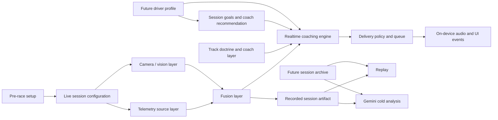
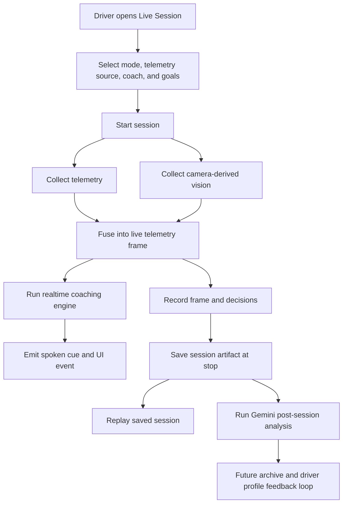
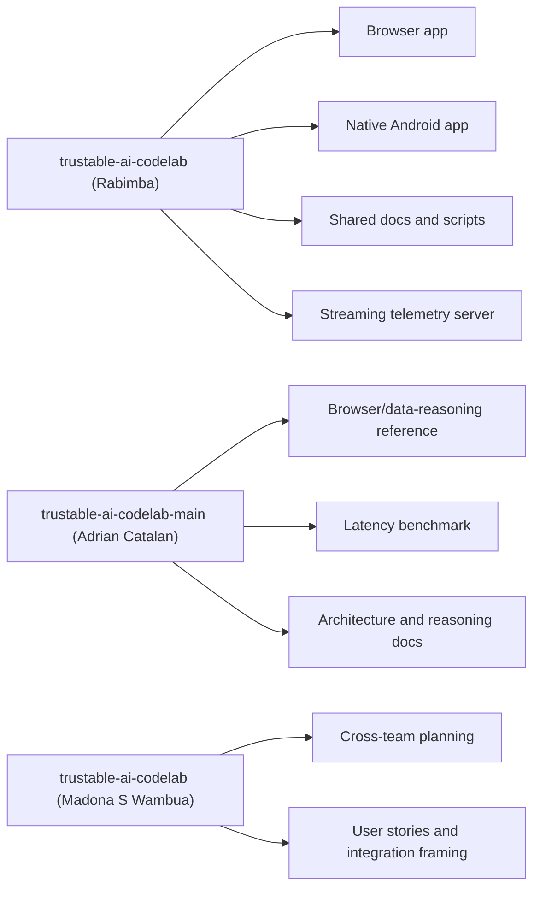
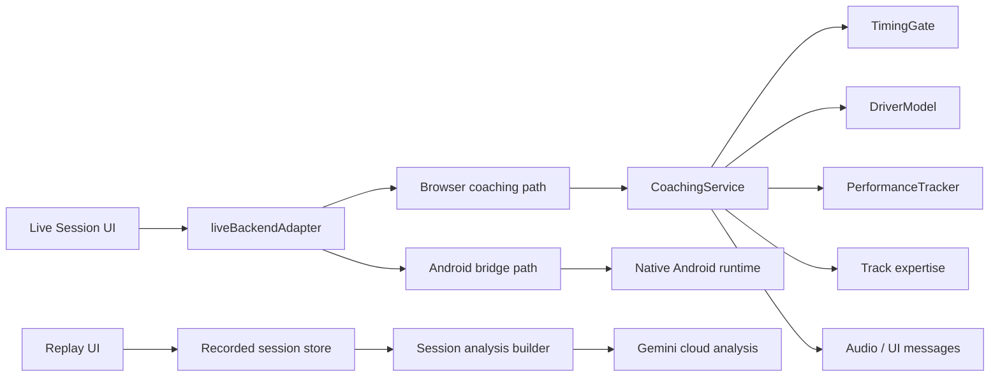
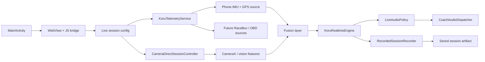
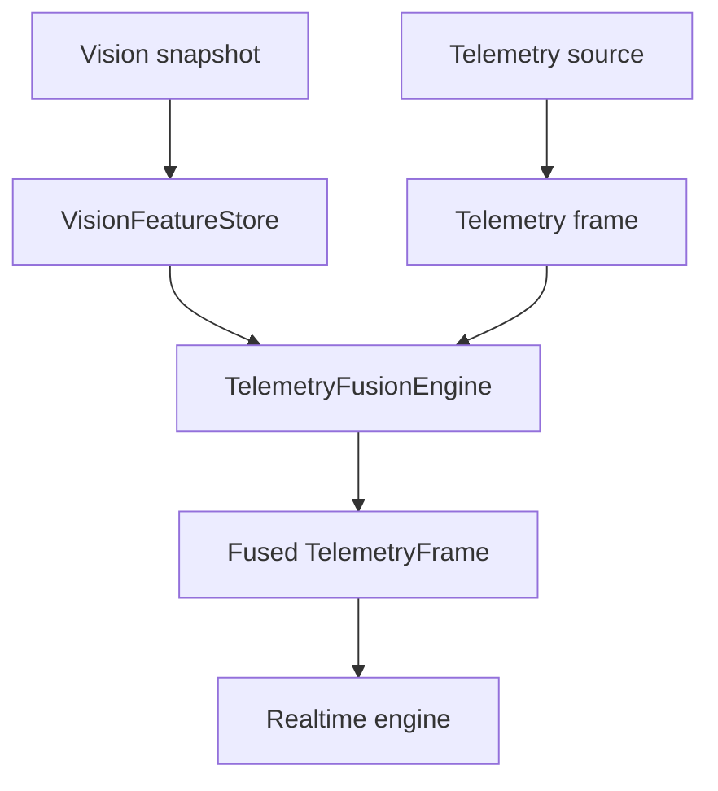
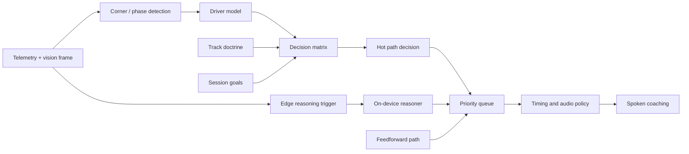
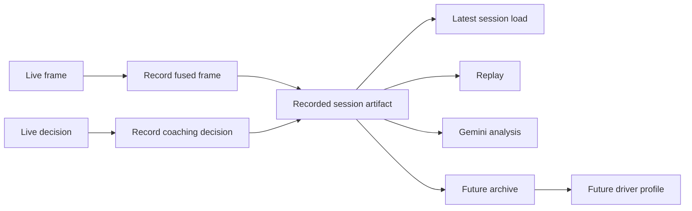

# End-to-End Architecture

**Branch:** `consolidated`  
**Last updated:** April 28, 2026  
**Purpose:** Describe the full project architecture end to end, show how the implemented pieces fit together, identify ownership and attribution, and explain how each subsystem contributes to the overall product story.

## Attribution Note

All implementation, integration, architecture, and documentation work completed in this working repository through this collaboration should be attributed to **Rabimba** unless a section explicitly calls out imported source material or borrowed reference artifacts from another attributed project.

## 1. Whole Product Story

The product story is:

1. A driver sets the session up before going on track.
2. The system chooses the right coaching context from:
   - selected coach
   - pre-race goals
   - track doctrine
   - driver state
3. During the drive, telemetry and camera data are fused into one live reasoning frame.
4. The hot path delivers low-latency coaching on device.
5. The session is saved as a structured artifact for replay and deeper analysis.
6. The cold path uses the saved artifact for Gemini-based review after the session.
7. Over time, a future driver-profile layer will learn from repeated sessions and feed better goals and coach recommendations back into the next drive.

That is the full story from “prepare for session” to “drive with coaching” to “analyze and improve.”

## 2. Ownership and Attribution

## 2.1 Project attribution

The three source projects should be credited this way:

| Project | Attribution | Role in the consolidated system |
|---|---|---|
| `trustable-ai-codelab` (Rabimba working repo) | **Rabimba** | Main implementation base and integration surface |
| `trustable-ai-codelab` (Madona S Wambua downloaded repo) | **Madona S Wambua** | Planning/reference repo and cross-team story source |
| `trustable-ai-codelab-main` (Adrian Catalan snapshot) | **Adrian Catalan** | Browser/data-reasoning reference repo and benchmark/doc source |

Within the consolidated project, the live Android runtime, the product integration work, the pre-race setup flow, the Sonoma deployment work, the saved-session flow, the replay/analysis integration, the new documentation set, and the architecture consolidation itself are all attributed to **Rabimba**.

## 2.2 Functional owners

| Area | Main owner | Current role |
|---|---|---|
| Product integration, live session UX, consolidation | **Rabimba** | Main implementation direction and integration owner |
| Browser/data-reasoning reference architecture | **Adrian Catalan** | Source attribution for advanced browser/data-reasoning design and latency benchmark |
| Cross-team stories and planning structure | **Madona S Wambua** | Source attribution for user-story framing and planning repo |
| AGY persistence and session intelligence backend | **Mike / AGY Pipeline** | Future archive, driver profile persistence, stored analytics |
| Domain coaching expertise | **Ross Bentley, T-Rod, Brian Luc** | Source-of-truth stakeholders for pedagogy, track doctrine, and realtime trust standard |

## 2.3 Implementation attribution matrix

This section answers the implementation question directly: who should be credited for which built pieces in the consolidated project.

| Implemented area | Implementation attribution | Notes |
|---|---|---|
| Native Android app, WebView host, JS bridge | **Rabimba** | Implemented in the current working repo |
| Native live-session runtime and mode routing | **Rabimba** | Includes telemetry, device test, and camera-direct modes |
| CameraX lane, vision feature extraction, and fusion wiring | **Rabimba** | Implemented in the current working repo |
| `phone_imu_gps` telemetry source | **Rabimba** | First real native telemetry source in the current working repo |
| Recorded native session artifacts, replay bridge, and saved-session flow | **Rabimba** | Implemented in the current working repo |
| Pre-race goals UI and coach recommendation flow | **Rabimba** | Implemented in the current working repo |
| Goal-aware live coaching integration | **Rabimba** | Implemented in browser and native integrated paths in the current working repo |
| Sonoma deployment work and doctrine integration | **Rabimba** | Implementation and integration attribution; doctrine content still traces back to Ross/T-Rod sources |
| Realtime speech hardening and live audio policy | **Rabimba** | Implemented in the current working repo |
| Replay and Gemini post-session integration | **Rabimba** | Implemented in the current working repo |
| Consolidation work, architecture docs, implementation history, and audit docs | **Rabimba** | Implemented in this collaboration in the current working repo |
| Browser/data-reasoning reference architecture | **Adrian Catalan** | Reference attribution, not the primary integrated runtime implementation in this branch |
| Imported hot-path latency benchmark | **Adrian Catalan** | Brought into the consolidated branch as a reference test artifact |
| Cross-team user-story framing and planning artifacts | **Madona S Wambua** | Reference attribution for planning and product story structure |

Implementation rule of thumb:

- if it was built or integrated in the current working `trustable-ai-codelab` repository, it should be attributed to **Rabimba**
- if it was brought in as a benchmark, planning artifact, or reference document from another project, it should keep its original attribution

## 3. Whole-System Diagram

## 4. The Main Runtime Story

### 4.1 Before the session

The driver chooses:

- live mode
- telemetry source
- coach
- pre-race goals

The system can then recommend a coach and carry the chosen goals into the live session config.

### 4.2 During the session

The live loop uses:

- telemetry as the main timebase
- the latest camera snapshot as fused vision context
- track doctrine and session goals to shape coaching
- timing, blackout, priority, and confidence logic to decide when to speak

This is where the realtime value is created.

### 4.3 After the session

The system saves:

- session metadata
- telemetry frames
- vision features
- coaching decisions
- session goals

Replay and Gemini then operate on the saved artifact instead of trying to reconstruct the session from transient live state.

## 5. End-to-End User Journey

## 6. Repository-Level Architecture

## 6.1 Consolidated project structure

## 6.2 What each project contributes now

| Project | Contribution to the whole story |
|---|---|
| **Rabimba repo** | Main runtime, native Android lane, current docs, integrated product flow |
| **Adrian Catalan repo** | Browser/data-reasoning architecture, benchmark/test reference, earlier reasoning framing |
| **Madona S Wambua repo** | User stories, cross-team planning, integration contract framing |

## 7. Browser Application Architecture

The browser application is still important even after the Android runtime exists. It handles:

- product UI
- replay
- analysis
- browser coaching path
- Android bridge integration when hosted in WebView

### Browser-side implemented pieces

| Capability | Implemented | Owner / attribution | Role in story |
|---|---|---|---|
| Live session UI | Yes | Rabimba | Session entry point |
| Pre-race goals UI | Yes | Rabimba | Shapes live coaching |
| Coach recommendation | Yes | Rabimba | Helps select coaching mode |
| Browser coaching engine | Yes | Rabimba + Adrian Catalan attribution | Browser live/replay reasoning path |
| Replay and analysis | Yes | Rabimba | Post-session review surface |
| Gemini cold analysis | Yes | Rabimba | Deeper post-session review |
| Hot-path latency benchmark | Yes | Adrian Catalan attribution, merged into consolidated | Measures browser hot-path performance |

## 8. Native Android Architecture

The native Android app is the main runtime upgrade beyond the original browser-only design.

### Native-side implemented pieces

| Capability | Implemented | Owner / attribution | Role in story |
|---|---|---|---|
| Android host app | Yes | Rabimba | Native execution surface |
| WebView bridge | Yes | Rabimba | Connects browser UI to native runtime |
| Telemetry service | Yes | Rabimba | Realtime native coaching lane |
| Camera-direct controller | Yes | Rabimba | Vision-only debug lane |
| `phone_imu_gps` source | Yes | Rabimba | First real native telemetry source |
| CameraX vision lane | Yes | Rabimba | Vision signal source |
| Realtime audio policy | Yes | Rabimba | Safer and cleaner live speech |
| Saved native session artifacts | Yes | Rabimba | Bridge from live session to replay/analysis |

## 9. Telemetry and Fusion Architecture

The telemetry and fusion layer is the core of the live system.

### Design decision

Telemetry is the master clock.

That means:

- telemetry drives the session forward
- camera does not own timing
- the latest vision snapshot is attached to the current telemetry frame

This gives cleaner replay, simpler reasoning, and a better path to real hardware telemetry.

## 10. Coaching Intelligence Architecture

The coaching engine is not just a prompt. It is a layered system.

### Coaching intelligence pieces implemented now

| Capability | Implemented | Owner / attribution | Role in story |
|---|---|---|---|
| Decision matrix | Yes | Data reasoning path, current integrated repo | Immediate rules |
| Timing gate | Yes | Data reasoning path | Controls when speech is allowed |
| Driver model | Yes | Data reasoning path | Adapts pacing and coaching |
| Track doctrine | Yes | Rabimba integration + Ross/T-Rod source attribution | Makes coaching track-aware |
| Session goal bias | Yes | Rabimba integration | Makes coaching session-aware |
| On-device edge reasoner | Yes | Rabimba native runtime | Adds adaptive live cues |
| Coach personas | Yes | Browser/data reasoning lineage + Rabimba integration | Voice/style layer |

## 11. Session Data Lifecycle

### Implemented now

- latest saved session artifact
- replay loading of latest native capture
- Gemini post-session analysis over saved artifact

### Not implemented yet

- multi-session archive
- raw video bound to the artifact
- stored Gemini report attached to archive entries

## 12. Story Map: What Is Implemented Together

This is the clearest “whole story” view.

| Story stage | Implemented now | Main owner | How it contributes |
|---|---|---|---|
| Pre-race | Goals UI, coach recommendation, mode/source selection | Rabimba | Shapes the session before the first frame |
| Live sensing | Phone telemetry, camera vision, fusion | Rabimba | Creates the live data stream |
| Live reasoning | Hot/feedforward/edge logic, doctrine, goals, timing | Rabimba + browser/data reasoning lineage | Produces realtime coaching |
| Live delivery | On-device audio, queue, speech gating | Rabimba | Makes feedback usable during driving |
| Save session | Recorded native artifact | Rabimba | Preserves the drive for later review |
| Post-session | Replay, Gemini analysis | Rabimba | Turns a drive into a teachable review |
| Future loop | Archive, driver profile, hardware telemetry | AGY / Edge / future integration work | Makes the system compound over time |

## 13. What Is Still Missing From the End-to-End Story

The end-to-end architecture is now real, but not fully complete.

Still missing:

- real `RaceBox BLE` telemetry
- real `OBD Bluetooth` telemetry
- session archive
- raw video binding
- cross-session driver profile
- automatic goal/coach recommendation from prior sessions

These are not architecture gaps anymore. They are implementation gaps on top of a clear architecture.

## 14. Bottom Line

The project now has a complete architectural story:

- pre-race setup
- live multimodal sensing
- realtime on-device coaching
- saved session artifact
- replay and cloud review
- future long-term learning loop

The most important thing is that the pieces now line up into one coherent product story instead of separate demos:

- the browser app is the product surface
- the Android app is the on-device runtime
- the telemetry/camera fusion layer is the live signal source
- the coaching engine is the reasoning core
- the session artifact is the bridge from live coaching to post-session analysis
- the future archive/profile layer is what will make the system improve over repeated sessions
